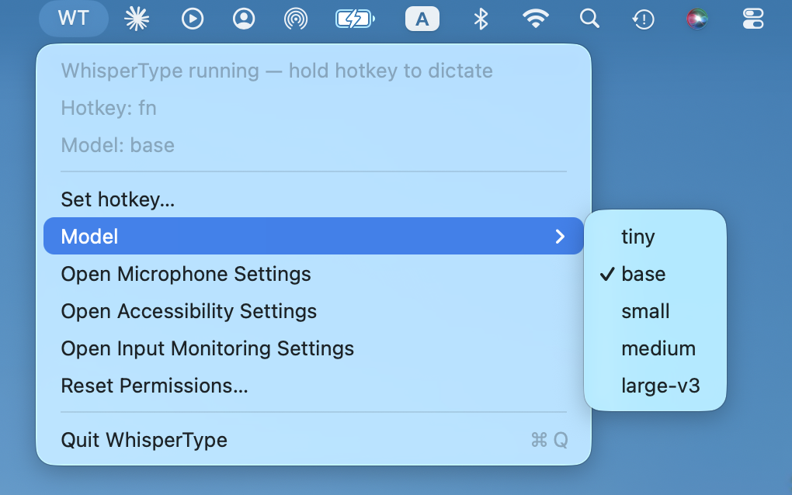

# WhisperType

Free, local-first voice typing for macOS. Hold a key, speak, release, and the transcribed text is pasted into whatever app your cursor is already in.

https://github.com/user-attachments/assets/7928793e-1da9-4450-bb69-6ce0afeb145a

*Holding `fn`, speaking, releasing — text appears in the active app. Watch the menu bar icon cycle through `WT` → `WT ●` (recording) → `WT…` (transcribing) → `WT`. Click the speaker icon to hear the live transcription.*

I was paying for tools like Wispr Flow and Glaido every month. They are great, but I kept wondering if SaaS like this is starting to look optional now that you can vibecode the core feature locally in a weekend. So I built WhisperType to find out.



*The menu bar UI — pick your Whisper model, set a custom hotkey, jump to the macOS permission panes, or wipe stale TCC grants with one click. Models on disk are marked; ones that need a download show their size up front.*

## What this is

The thing people actually pay for in those products is not file transcription. It is universal dictation. One hotkey, any app, instant text. That is what WhisperType does.

How it works:

1. Put your cursor in any app. Chrome, Gmail, Notion, Cursor, Claude, Slack, Telegram, Discord, whatever.
2. Hold `fn` (or any hotkey you set).
3. Speak.
4. Release the key.
5. WhisperType transcribes locally with open-source Whisper and pastes the cleaned text into the active app.

No paid API key. No account. No server. Your audio never leaves your machine.

## Why I built this

I kept asking myself: now that I can vibecode a working version of that core feature in a weekend with AI tools, is monthly SaaS for this kind of thing still the right shape? Or has the unit economics quietly flipped, where the paid version has to start justifying itself against a free local one that runs on your own machine?

I built WhisperType to find out. Not to replace any of those products, just to test the thesis with my own hands.

## What this is meant to show

I am going for AI product roles, so I want to be upfront: this is vibecoded. I am not the engineer who hand-wrote it. The thing I am demonstrating is not "I can code". It is the modern product job:

- Take a paid product's core job and identify the one feature people actually pay for.
- Scope it down to an MVP you can actually ship.
- Direct an AI to build it, and verify it works on real hardware before calling anything done.
- Make honest tradeoffs and put the rough edges in the README, not hide them.

A few product calls I made along the way:

- **Picked the core job.** These products do many things; voice-typing-anywhere is the one users pay for. Everything else got cut.
- **Local over cloud.** No API keys, no accounts, no server. The tradeoff is a one-time model download and slower transcription on small Macs. Worth it for free and private.
- **Started with `fn` only, then realised the real requirement was "the user picks their own hotkey".** Reframed the scope mid-build and added the menu bar capture UI.
- **Kept Terminal mode as an escape hatch.** When the bundled `.app` had permissions issues, I shipped both paths instead of waiting for a perfect fix.
- **Named the rough edges.** TCC grants reset on rebuild because of ad-hoc signing. That's documented in the setup section, not buried.

How I actually work with AI to ship things:

- I describe the user-facing goal. The AI proposes architecture. I verify end-to-end and push back when the diagnosis is wrong. (Example: a "fixed" version still wasn't catching `fn` events. The AI was confident the code was right; I caught that the `.app` bundle had not been rebuilt, so the new Python code was running against a stale Obj-C launcher.)
- I learn just enough of the platform vocabulary (macOS permissions, code signing, why permissions don't transfer across binaries) to spot when the AI is solving the wrong problem.
- Tests exist for the parts I needed confidence in. Not because I wrote them, but because I asked for them and read the assertions before merging.

## What this is not

Not a competitor to any paid dictation tool. Not a polished consumer product. Not a claim that AI tools make this effortless. They don't. The work is in the spec, the verification, and the judgement calls.

## What works today

- Global hold-to-dictate on macOS, runs from a real `.app` bundle so you can launch it from Spotlight or Finder like any normal Mac app.
- Configurable hotkey. Default is `fn` / Globe, change it any time from the menu bar via *Set hotkey…*. Your choice persists to `~/.config/whispertype/hotkey.txt`.
- Local microphone recording while the key is held.
- Local transcription with `faster-whisper`. Defaults to English so it does not hallucinate other languages. Model is configurable from the menu bar (tiny / base / small / medium / large-v3), persists to `~/.config/whispertype/model.txt`.
- The Model submenu shows which models are already downloaded vs which still need a download. Click *Download* on a missing model to fetch it in the background while you keep dictating with your current one. When it is done, the menu shows it as ready next time you open it.
- Picking a new model **restarts the transcription worker in place** so the new model takes effect right away — no quit-and-reopen dance.
- Live status indicator in the menu bar: `WT` idle, `WT ●` recording, `WT…` transcribing, `WT !` error. So you can tell at a glance whether a slow model is still working.
- Clipboard + Cmd+V paste into the active app.
- Menu bar shortcuts to all three macOS permission panes, plus a one-click *Reset Permissions…* item that wipes stale TCC grants after rebuilds.
- Light cleanup: trims um/uh fillers, fixes spacing, capitalises, adds final punctuation.
- Temp recordings are deleted right after Whisper finishes, so nothing piles up on disk.
- Tests for the dictation controller, hotkey config, fn listener, and bundle builder.

## What's next

- Optional silence auto-stop, so you don't have to hold the key.
- Local text cleanup presets (raw transcript, polished message, email style, coding prompt).
- A stable signing identity so permission grants survive rebuilds.
- An install script so trying it on a fresh Mac is one command, not eight.

---

# How to install and run

The portfolio narrative is above. Everything below is for anyone who actually wants to run it on their own Mac.

## Install on your Mac

```bash
git clone https://github.com/mikkaarumugam/whispertype.git
cd whispertype
python3 -m venv .venv
source .venv/bin/activate
pip install -e '.[dev]'
```

If `sounddevice` complains, install PortAudio:

```bash
brew install portaudio
pip install -e '.[dev]'
```

## Run as a menu bar app (recommended)

Build the local app launcher once, then open it like any Mac app:

```bash
cd whispertype
source .venv/bin/activate
whispertype-build-app --repo-dir "$PWD" --model base --language en
open dist/WhisperType.app
```

You'll get a `WT` item in the menu bar. From there you can pick the Whisper model, set a hotkey, open the permission panes, and reset permissions after a rebuild. The native launcher owns the hotkey listener, so macOS permission grants attach to WhisperType.app (not Python).

When you pull updates and rebuild:

```bash
cd whispertype
git pull
source .venv/bin/activate
pip install -e .
whispertype-build-app --repo-dir "$PWD" --model base --language en
cp -R dist/WhisperType.app /Applications/
open /Applications/WhisperType.app
```

Then click `WT` → *Reset Permissions…* to re-grant (rebuilds invalidate TCC grants — see permissions section below).

The app writes launch errors to `~/Library/Logs/WhisperType/launcher.log`:

```bash
tail -80 ~/Library/Logs/WhisperType/launcher.log
```

When the hotkey is healthy, the log should include lines like:

```text
[WhisperType] launcher CGEventTap installed (bundle owns hotkey trust)
[WhisperType] fn down
[WhisperType] fn up
```

### Change the hotkey

Click `WT` → *Set hotkey…*, then press the key or combo you want. The choice persists across launches.

### Faster dev loop

For local debugging, use the one-command restart loop instead of repeatedly copying the full rebuild block:

```bash
whispertype-dev-restart --hold-key '<179>'
```

It pulls, reinstalls, kills old app/Python workers, rebuilds, opens `WhisperType.app`, and prints the latest launcher log. Use `--no-pull --no-install` when only testing local code changes.

## Run from terminal (alternative)

Useful for debugging or if the `.app` bundle is acting up.

```bash
cd whispertype
source .venv/bin/activate
whispertype --model tiny --language en
```

If you want Whisper to auto-detect language instead:

```bash
whispertype --model tiny --language auto
```

Then:

1. Click into any text box in any app.
2. Hold `fn`.
3. Speak.
4. Release `fn`.
5. Wait for transcription.
6. Text should paste into the active app.

### Terminal-mode hotkey fallback

If `fn` isn't detected when running from Terminal, first inspect what macOS exposes:

```bash
python scripts/detect_keys.py
```

Press `fn` / Globe and look at the printed `normalised=` value. Then run with that value:

```bash
whispertype --model tiny --hold-key f18
```

Or try another key name your keyboard listener can see. On Mikka's Mac, `fn` / Globe shows up as raw `<179>`:

```bash
whispertype --model tiny --hold-key '<179>'
```

When running from the `.app` bundle (recommended above), this fallback isn't needed — the native launcher detects `fn` / Globe directly.

## macOS permissions needed

WhisperType needs three macOS permissions:

- **Microphone**, to record your voice.
- **Accessibility**, to send Cmd+V into the active app.
- **Input Monitoring**, to detect the global hotkey.

If macOS does not prompt automatically, open **System Settings → Privacy & Security**. The `WT` menu has direct shortcuts to all three panes: *Open Microphone Settings*, *Open Accessibility Settings*, *Open Input Monitoring Settings*.

**Running from `/Applications/WhisperType.app` (recommended).** The bundle's native launcher owns the hotkey listener, so you only need to enable **WhisperType** in all three panes. There is no separate "Python 3" row to worry about.

**Running from Terminal.** Grant the same permissions to whichever terminal you use (Terminal, iTerm, the Cursor or VS Code terminal, etc.).

### The rebuild ritual

macOS ties permission grants to the binary's code signature, not the bundle ID. Every time you run `whispertype-build-app`, the signature changes and your previous grants stop applying, even though the app name and bundle ID are identical. You will hit this every single rebuild until you set up code signing.

**The one-click fix lives in the menu.** Click `WT` → **Reset Permissions…**. It wipes the TCC records for all three buckets and opens the Accessibility pane.

Steps after clicking Reset Permissions:

1. **Accessibility (manual add):** drag `/Applications/WhisperType.app` into the open Accessibility list, or click the **+** button and pick it. Toggle it on. macOS does **not** auto-prompt for this one because the synthesized Cmd+V used to paste fails silently when denied.
2. Click `WT` → **Open Input Monitoring Settings** → toggle WhisperType on (or drag it in via the **+** button if it's not in the list).
3. Click `WT` → **Quit WhisperType**, then reopen from `/Applications`.
4. **Microphone (auto-prompted only):** the Microphone pane does **not** let you add apps manually. Hold fn for the first time after reopening; macOS will pop up an Allow/Deny dialog. Click Allow. WhisperType then appears in System Settings → Microphone with its toggle on.

If for some reason the menu item is unavailable (e.g. the binary won't launch), the equivalent terminal commands are:

```bash
tccutil reset Microphone com.mikka.open-transcribe-studio.whispertype
tccutil reset ListenEvent com.mikka.open-transcribe-studio.whispertype
tccutil reset Accessibility com.mikka.open-transcribe-studio.whispertype
```

### Troubleshooting by symptom

**Pressing the hotkey does nothing. The `WT` icon never changes.**
Input Monitoring is denied. Click `WT` → Open Input Monitoring Settings, toggle WhisperType on (or drag it in if it's not in the list), then quit + reopen WhisperType.

**`WT ●` lights up while you hold the hotkey, but no orange mic dot appears in the macOS menu bar, and nothing transcribes.**
Microphone is denied. **The Microphone pane does not let you manually add apps** — you have to trigger the request. Just keep WhisperType running and hold fn one more time; macOS will pop up an Allow/Deny dialog. Click Allow. WhisperType then appears in System Settings → Microphone, where you can later toggle it off if needed.

**Dictation transcribes (you see WT…) but nothing pastes into your text field. Manual Cmd+V works fine.**
This is the most common one and almost always Accessibility. Try in order:

1. Click `WT` → Open Accessibility Settings. Confirm WhisperType is toggled **on**. Quit + reopen WhisperType.
2. If that doesn't fix it: in Accessibility, click the WhisperType row, press the **minus (–) button** at the bottom of the list to remove it entirely. Then drag `/Applications/WhisperType.app` back into the list (or wait for macOS to re-prompt on your next dictation attempt). The toggle was bound to a stale code signature from a previous build; removing forces a clean re-bind to the current binary.
3. If still broken: click `WT` → Reset Permissions… and start fresh.

**Everything was working yesterday and now it isn't.**
You rebuilt the `.app` since. Click `WT` → Reset Permissions… and follow the steps above.

A proper signing identity would fix all of this once and for all. Ad-hoc dev builds are why you keep hitting it.

## Choosing a Whisper model

WhisperType uses [`faster-whisper`](https://github.com/SYSTRAN/faster-whisper), which ships several model sizes. Bigger models are more accurate but slower and bigger on disk. For hotkey-style dictation (short clips, mostly clear English), **`base` is the sweet spot** and it is the default.

| Model | Disk | Transcribe time (≈5 sec clip, typical M1/M2 Mac) | Accuracy | When to pick it |
|---|---|---|---|---|
| `tiny` | ~75 MB | ~0.5 sec | weakest | Smoke-testing setup only. Will mishear short or accented speech. |
| **`base`** | ~150 MB | ~1 sec | decent | **Default.** Good for clear English dictation on a typical Mac. Feels instant. |
| `small` | ~480 MB | ~3 sec | noticeably better | Bump to this if `base` keeps mishearing your accent, common words, or background noise. Noticeable wait but usable. |
| `medium` | ~1.5 GB | ~8 sec | strong | Overkill for short dictation. The wait feels broken even though it is working. |
| `large-v3` | ~3 GB | ~15+ sec | best | Way overkill for hotkey dictation. You will think it is frozen. It is not, it is just slow. |

For hotkey dictation, the useful range is realistically **`base` or `small`**. Past that, the wait kills the whole point of the hotkey. `medium` and `large-v3` are included for completeness and for cases where you do not mind waiting (e.g. you released fn and are happy to wait for a more accurate transcription of a longer clip).

**The WT menu bar icon changes while it's working**, so you know something is happening even on the slow models:

- `WT`: idle, ready for input.
- `WT ●`: recording (hotkey held).
- `WT…`: transcribing (Whisper is running).
- `WT !`: something errored. Check `~/Library/Logs/WhisperType/launcher.log`.

If `WT…` is sitting there for 10+ seconds, the app is not frozen. That is just `medium` or `large-v3` doing its thing.

### Change the model from the menu bar

Click `WT` → *Model* and you will see one of three labels for each model:

- **Just the name (e.g. `base`)** — downloaded and ready. A checkmark next to it means it is the active model. Click to switch to it.
- **`medium — Download (1.5 GB)`** — not on disk yet. Click to start a background download. You can keep dictating with your current model while it runs.
- **`medium — Downloading…`** — a download is in flight. Open this menu again in a minute or two; when the model is ready, the label flips to plain `medium` with no suffix.

When you click a downloaded model, WhisperType saves your choice to `~/.config/whispertype/model.txt` and **restarts the transcription worker in place** so the new model takes effect right away. The launcher itself stays alive (menu bar, hotkey, status indicator all keep working). Give it a few seconds before your first dictation, especially for the bigger models: `medium` and `large-v3` need 10–20 seconds to load into RAM the first time.

Downloaded models are cached under `~/.cache/huggingface/hub/models--Systran--faster-whisper-{name}/`. This is a one-time cost per model.

You can also pick a model at the command line when running from Terminal, or when building the `.app`:

```bash
whispertype --model small
.venv/bin/whispertype-build-app --model small
```

The CLI flag controls the *initial default*; the menu choice overrides it on next launch.

## Privacy: what is stored locally

WhisperType is local-first. Nothing is uploaded anywhere. But two things do get written to your Mac while the app runs:

- **A log file** at `~/Library/Logs/WhisperType/launcher.log`. This includes diagnostic lines AND the transcribed text of what you said (so you can debug bad transcriptions). It is plain text. Read it with `tail -80 ~/Library/Logs/WhisperType/launcher.log`. Wipe it any time with `rm ~/Library/Logs/WhisperType/launcher.log`.
- **A temporary `.wav` recording per hotkey press**, written to the macOS temp folder (`/var/folders/.../T/whispertype-*.wav`) so Whisper can read it. WhisperType deletes each one as soon as transcription finishes. If you ever want to double-check nothing is sitting around, run `ls /var/folders/*/T/whispertype-*.wav 2>/dev/null` (no output = nothing there).

## Run tests

```bash
pytest -q
```
